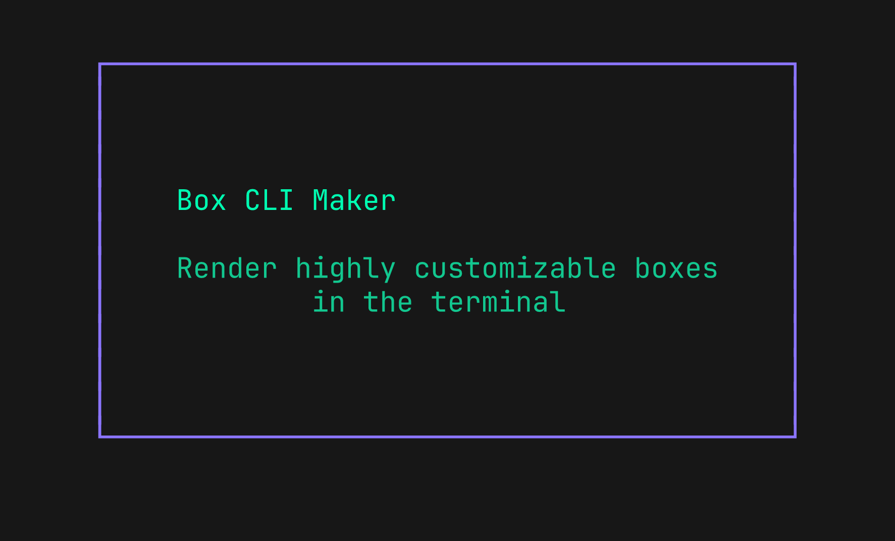
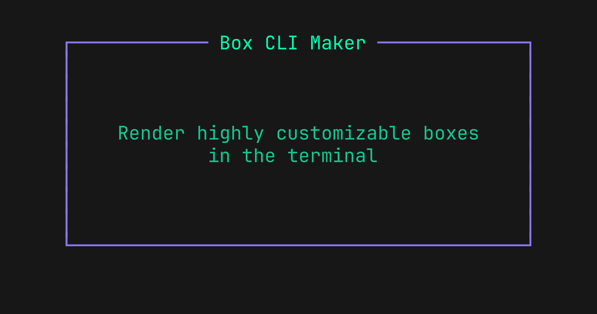
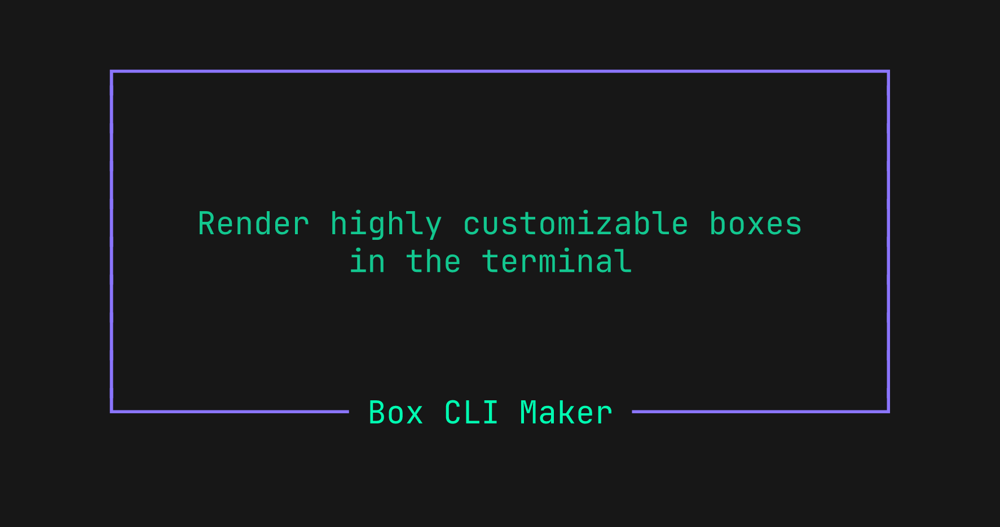
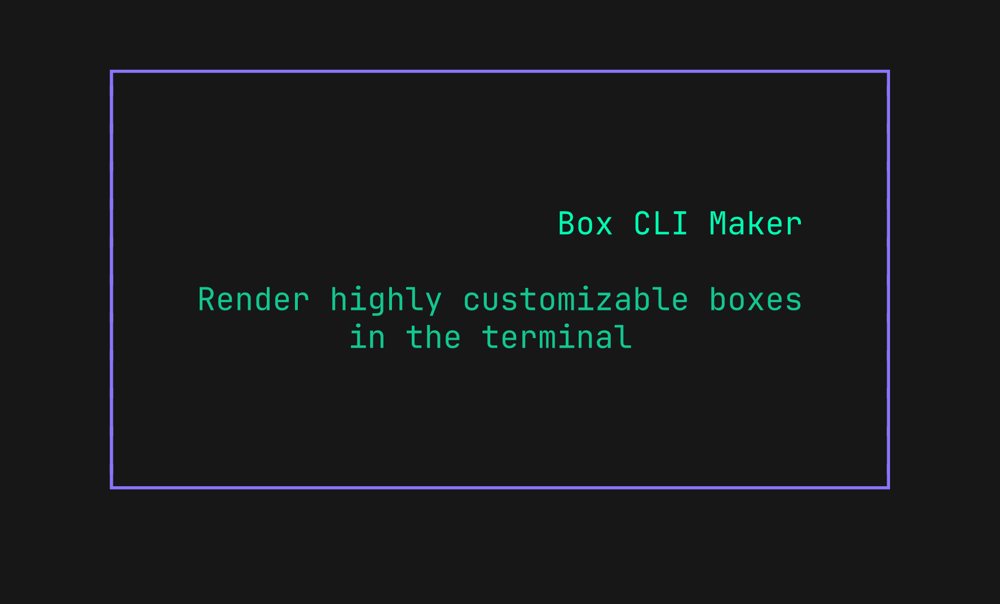
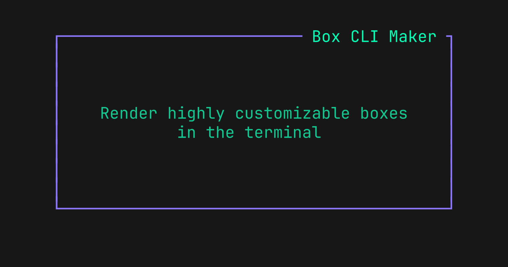
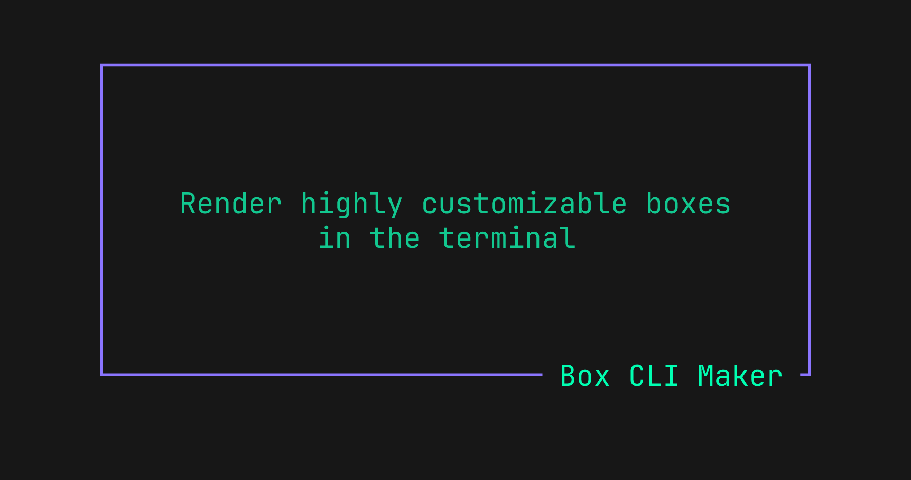

# Box CLI Maker

<div align="center">


[](https://pkg.go.dev/github.com/box-cli-maker/box-cli-maker/v3)
[](https://github.com/box-cli-maker/box-cli-maker/actions/workflows/go.yml)
[](https://goreportcard.com/report/github.com/box-cli-maker/box-cli-maker/v3)
[](https://github.com/box-cli-maker/box-cli-maker/releases)
[](https://github.com/avelino/awesome-go)

Box CLI Maker is a Go library for rendering highly customizable boxes in the terminal.


</div>

## Features

- 9 built‑in styles (Single, Double, Round, Bold, SingleDouble, DoubleSingle, Classic, Hidden, Block)
- Custom glyphs for all corners and edges
- Title positions: Inside, Top, Bottom
- Title & Content alignment: Left, Center, Right
- Optional content wrapping with `WrapContent` and `WrapLimit`
- Color support with:
  - First 16 ANSI color names
  - `#RGB`, `#RRGGBB`, `rgb:RRRR/GGGG/BBBB`, `rgba:RRRR/GGGG/BBBB/AAAA`
- Unicode and emoji support with proper width handling
- Explicit errors from `Render`, plus `MustRender` for panic‑on‑error 

## Installation

```bash
go get github.com/box-cli-maker/box-cli-maker/v3
```

## Quick Start

```go
package main

import (
    "fmt"

    box "github.com/box-cli-maker/box-cli-maker/v3"
)

func main() {
    b := box.NewBox().
    Style(box.Single).  // single-line border
    Padding(2, 1).      // inner padding: x (horizontal), y (vertical)
    TitlePosition(box.Top).
    ContentAlign(box.Center).
    Color(box.Cyan).
    TitleColor(box.BrightYellow)

    out, err := b.Render("Box CLI Maker", "Render highly customizable boxes\n in the terminal")
    if err != nil {
        panic(err)
    }
    fmt.Println(out)
}
```

`NewBox` constructs a box with the default `Single` style.  
Configure it via fluent methods, then call `Render` (or `MustRender`) to get the box as a string.

## API Overview

### Construction

```go
b := box.NewBox() // recommended
```

You can clone a configured box and tweak it:

```go
base := box.NewBox().
        Style(box.Single).
        Padding(2, 1).
        ContentAlign(box.Left)

info := base.Copy().Color(box.Green)
warn := base.Copy().Color(box.Yellow)
```

### Styles

Select a built‑in style:

```go
b.Style(box.Double)
```
#### Styles showcase

<details>
<summary><code>box.Single</code></summary>

<p align="center" style="margin-top: 30px; margin-bottom: 20px;">

</p>

</details>

<details>
<summary><code>box.SingleDouble</code></summary>

<p align="center" style="margin-top: 30px; margin-bottom: 20px;">

</p>

</details>

<details>
<summary><code>box.Double</code></summary>

<p align="center" style="margin-top: 30px; margin-bottom: 20px;">

</p>

</details>

<details>
<summary><code>box.DoubleSingle</code></summary>

<p align="center" style="margin-top: 30px; margin-bottom: 20px;">

</p>

</details>

<details>
<summary><code>box.Bold</code></summary>

<p align="center" style="margin-top: 30px; margin-bottom: 20px;">

</p>

</details>

<details>
<summary><code>box.Round</code></summary>

<p align="center" style="margin-top: 30px; margin-bottom: 20px;">

</p>

</details>

<details>
<summary><code>box.Hidden</code></summary>

<p align="center" style="margin-top: 30px; margin-bottom: 20px;">

</p>

</details>

<details>
<summary><code>box.Classic</code></summary>

<p align="center" style="margin-top: 30px; margin-bottom: 20px;">

</p>

</details>

<details>
<summary><code>box.Block</code></summary>

<p align="center" style="margin-top: 30px; margin-bottom: 20px;">

</p>

</details>


You can override any glyph after choosing a style:

```go
b.Style(box.Single).
  TopLeft("+").
  TopRight("+").
  BottomLeft("+").
  BottomRight("+").
  Horizontal("-").
  Vertical("|")
```

### Titles and Alignment

Title position:

```go
b.TitlePosition(box.Inside) // default
b.TitlePosition(box.Top)
b.TitlePosition(box.Bottom)
```

#### Title Position showcase

<details>
<summary><code>box.Inside</code></summary>

<p align="center" style="margin-top: 30px; margin-bottom: 20px;">

</p>

</details>

<details>
<summary><code>box.Top</code></summary>

<p align="center" style="margin-top: 30px; margin-bottom: 20px;">

</p>

</details>

<details>
<summary><code>box.Bottom</code></summary>

<p align="center" style="margin-top: 30px; margin-bottom: 20px;">

</p>

</details>

Title alignment:

```go
b.TitleAlign(box.Left) // default for box.Top/box.Bottom Title Position
b.TitleAlign(box.Center) // default for box.Inside Title Position
b.TitleAlign(box.Right)
```

#### Title Alignment showcase

<details>
<summary><code>box.Left</code></summary>

<details>
<summary><code>box.Inside</code></summary>

<p align="center" style="margin-top: 30px; margin-bottom: 20px;">

</p>

</details>

<details>
<summary><code>box.Top</code></summary>

<p align="center" style="margin-top: 30px; margin-bottom: 20px;">

</p>

</details>

<details>
<summary><code>box.Bottom</code></summary>

<p align="center" style="margin-top: 30px; margin-bottom: 20px;">

</p>

</details>

</details>

<details>
<summary><code>box.Center</code></summary>

<details>
<summary><code>box.Inside</code></summary>

<p align="center" style="margin-top: 30px; margin-bottom: 20px;">

</p>

</details>

<details>
<summary><code>box.Top</code></summary>

<p align="center" style="margin-top: 30px; margin-bottom: 20px;">

</p>

</details>

<details>
<summary><code>box.Bottom</code></summary>

<p align="center" style="margin-top: 30px; margin-bottom: 20px;">

</p>

</details>

</details>

<details>
<summary><code>box.Right</code></summary>

<details>
<summary><code>box.Inside</code></summary>

<p align="center" style="margin-top: 30px; margin-bottom: 20px;">

</p>

</details>

<details>
<summary><code>box.Top</code></summary>

<p align="center" style="margin-top: 30px; margin-bottom: 20px;">

</p>

</details>

<details>
<summary><code>box.Bottom</code></summary>

<p align="center" style="margin-top: 30px; margin-bottom: 20px;">

</p>

</details>

</details>

Content alignment:

```go
b.ContentAlign(box.Left) // default
b.ContentAlign(box.Center)
b.ContentAlign(box.Right)
```

#### Content Alignment showcase

<details>
<summary><code>box.Left</code></summary>

<p align="center" style="margin-top: 30px; margin-bottom: 20px;">

</p>

</details>

<details>
<summary><code>box.Center</code></summary>

<p align="center" style="margin-top: 30px; margin-bottom: 20px;">

</p>

</details>

<details>
<summary><code>box.Right</code></summary>

<p align="center" style="margin-top: 30px; margin-bottom: 20px;">

</p>

</details>


### Padding

```go
b.Padding(px, py) // horizontal (px) and vertical (py) padding
b.HPadding(px)    // horizontal only
b.VPadding(py)    // vertical only
```

Setting negative padding causes `Render` to return an error.

### Wrapping

```go
b.WrapContent(true)       // enable wrapping (default width: 2/3 of terminal)
b.WrapLimit(40)           // set explicit wrap width (enables wrapping)
b.WrapContent(false)      // disable wrapping
```

`Render` returns an error if the wrap limit is negative or the terminal width cannot be determined when wrapping is enabled without a limit.

### Colors

Colors can be applied to:

- Title: `TitleColor`
- Content: `ContentColor`
- Border: `Color`

Accepted formats:

- First 16 ANSI names:

  `box.Black, box.Red, box.Green, box.Yellow, box.Blue, box.Magenta, box.Cyan, box.White` and their bright variants:
  `box.BrightBlack, box.BrightRed, box.BrightGreen, box.BrightYellow, box.BrightBlue, box.BrightMagenta, box.BrightCyan, box.BrightWhite`  
  (plus a few aliases like `box.HiRed`, `box.HiBlue`, etc.)

- Hex and XParseColor formats (Supports TrueColor and 8-bit):

  - `#RGB`
  - `#RRGGBB`
  - `rgb:RRRR/GGGG/BBBB`
  - `rgba:RRRR/GGGG/BBBB/AAAA`

Example:

```go
b.TitleColor(box.BrightYellow)
b.ContentColor("#00FF00")
b.Color("rgb:0000/ffff/0000")
```

Invalid colors cause `Render` to return an error.

### Rendering

```go
out, err := b.Render("Title", "Content")
if err != nil {
    // handle invalid style, colors, padding, wrapping, etc.
}

fmt.Println(out)
```

`Render` returns an error if:

- The `BoxStyle` is invalid
- The `TitlePosition` is invalid
- The `TitleAlign` or `ContentAlign` is invalid
- The wrap limit is negative
- Padding is negative
- A multiline title is used with a non‑`Inside` title position
- Any configured colors are invalid
- Terminal width detection fails when needed for wrapping

For convenience:

```go
out := b.MustRender("Title", "Content") // panics on error
```

## Examples

The [examples](examples) directory contains small, focused programs that showcase different features:

- `simple_box` – minimal single box with title and content.
- `content_align` – compare `Left`, `Center`, and `Right` content alignment.
- `content_wrap` – demonstrate `WrapContent` / `WrapLimit` with long text.
- `title_positions` – show `Inside`, `Top`, and `Bottom` title placement.
- `title_alignments` – compare `Left`, `Center`, and `Right` title alignment.
- `box_styles` – render all built‑in border styles and colors.
- `custom_box` – build boxes using fully custom corner/edge glyphs.
- `ansi_styles_and_links` – use bold/underline/blink/strikethrough and OSC 8 hyperlinks.
- `colors_and_unicode` – mix hex/ANSI colors with CJK, emoji, and wrapping.
- `ansi_art` – render more decorative/"artistic" boxes.
- `shared_styles` – derive multiple boxes from a shared base style with `Copy`.
- `ksctl` – real‑world example from ksctl showing wide titles vs narrow content.
- `lolcat` – rainbow color demo using custom ANSI styling helpers.
- `readme` – code used to generate the screenshot at the top of this README.

## Unicode, Emoji, and Width Handling

This library uses [`mattn/go-runewidth`](https://github.com/mattn/go-runewidth) and [`github.com/charmbracelet/x/ansi`](https://github.com/charmbracelet/x/ansi) to handle:

- Wide characters (e.g., CJK)
- Emojis and other multi‑cell glyphs
- Stripping ANSI sequences when measuring widths

Note:

1. Rendering quality depends on the terminal emulator and font. Some combinations may misalign visually.
2. Indic scripts and complex text may not display correctly in most terminals.
3. Online playgrounds and many CI environments often use basic fonts and may not render Unicode/emoji correctly; widths might be misreported.

## Migration from v2

v3 is a new major version with a redesigned API.

Key changes:

- `Config` struct and `New(Config)` have been replaced with:

  ```go
  b := box.NewBox().
      Style(box.Single).
      Padding(2, 1).
      TitlePosition(box.Top).
      ContentAlign(box.Left)
  ```

- String‑based fields (`Type`, `ContentAlign`, `TitlePos`) are now strongly typed:
  - `"Single"` → `box.Single`
  - `"Top"` → `box.Top`
  - `"Center"` → `box.Center`

- Colors:
  - No more `interface{}` colors (`uint`, `[3]uint`, etc.).
  - Use ANSI names or the documented hex/rgb formats instead.
  - Invalid colors now **error** at `Render` time.

- `Print` / `Println` behavior can be replicated by `fmt.Println(b.MustRender(...))` or your own helper.

Read more at [Migration guide](./MIGRATION.md).

The old v2 API remains available at:

```bash
go get github.com/Delta456/box-cli-maker/v2
```

but is no longer actively developed.

## Projects Using Box CLI Maker

-  [kubernetes/minikube](https://github.com/kubernetes/minikube): Run Kubernetes locally.
- And others listed on [pkg.go.dev](https://pkg.go.dev/github.com/box-cli-maker/box-cli-maker/v3?tab=importedby).

## Acknowledgements

Thanks to:

- [thecodrr/boxx](https://github.com/thecodrr/boxx)
- [Atrox/box](https://github.com/Atrox/box)
- [sindreorhus/cli-boxes](https://github.com/sindresorhus/cli-boxes)

for inspiration, and to all contributors who have improved this library over time.

## License

Licensed under [MIT](LICENSE).
